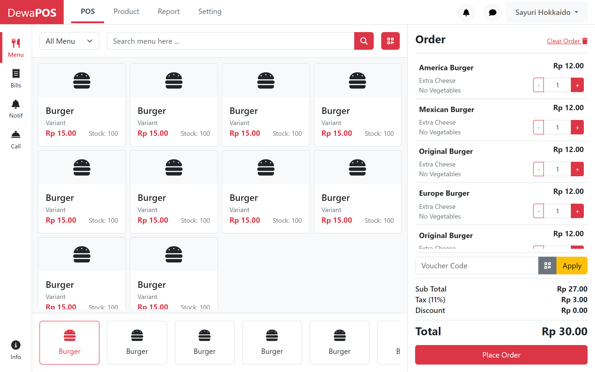

# DewaPOS

<div align="center">
	
</div>

> Generated with [gulp-template-bs5](https://github.com/zeindevs/gulp-template-bs5)

## Features?

- Hot Reloading with `browser-sync`
- Use `ejs` templating
- Styling with `sass`
- JavasScript Bundler with `rollup`

## Scripts Usage

### Start Development

```sh
npm start
pnpm start
yarn start
```

### Build

```sh
npm run build
pnpm build
yarn build
```

### Prettier

```sh
# for ejs in src
npm run pretty
pnpm pretty
yarn pretty

# for html in dist
npm run pretty:dist
pnpm pretty:dist
yarn pretty:dist
```

## License

```
Copyright 2024 zeindevs

Licensed under the Apache License, Version 2.0 (the "License");
you may not use this file except in compliance with the License.
You may obtain a copy of the License at

   http://www.apache.org/licenses/LICENSE-2.0

Unless required by applicable law or agreed to in writing, software
distributed under the License is distributed on an "AS IS" BASIS,
WITHOUT WARRANTIES OR CONDITIONS OF ANY KIND, either express or implied.
See the License for the specific language governing permissions and
limitations under the License.
```